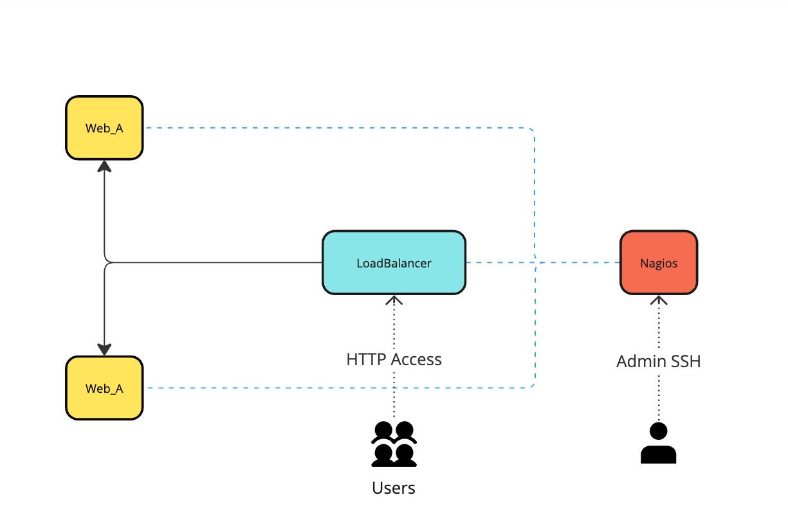

<h1 align="center">InfrastructureProject</h1>

<p align="center">
  

  

  

  

  <!--  -->

  <!--  -->

  <!--  -->
</p>

<!-- Status -->

<!-- <h4 align="center">
	🚧  InfrastructureProject 🚀 Under construction...  🚧
</h4>

<hr> -->

<p align="center">
  <a href="#dart-about">About</a> &#xa0; | &#xa0;
  <a href="#sparkles-features">Features</a> &#xa0; | &#xa0;
  <a href="#rocket-technologies">Technologies</a> &#xa0; | &#xa0;
  <a href="#white_check_mark-requirements">Requirements</a> &#xa0; | &#xa0;
  <a href="#checkered_flag-starting">Starting</a> &#xa0; | &#xa0;
  <a href="#memo-license">License</a> &#xa0; | &#xa0;
  <a href="https://github.com/kvncampos" target="_blank">Author</a>
</p>

<br>

## :dart: About

InfrastructureProject is a robust solution designed to streamline infrastructure automation, testing, and deployment. It leverages modern tools like Flask, Docker, Invoke, Poetry, Nagios, and HAProxy to create a seamless environment for development and operations.

{ loading=lazy }

## :sparkles: Features

:heavy_check_mark: Automated testing with Pytest;\
:heavy_check_mark: Task automation using Invoke;\
:heavy_check_mark: Service monitoring with Nagios;\
:heavy_check_mark: Web server setup with Flask;\
:heavy_check_mark: Load balancing with HAProxy;\
:heavy_check_mark: Containerized deployments using Docker;\
:heavy_check_mark: Dependency management with Poetry.

## :rocket: Technologies

The following tools and technologies are used in this project:

- [Flask](https://flask.palletsprojects.com/)
- [Docker](https://www.docker.com/)
- [Invoke](https://www.pyinvoke.org/)
- [Poetry](https://python-poetry.org/)
- [Nagios](https://www.nagios.org/)
- [HAProxy](http://www.haproxy.org/)
- [Pytest](https://pytest.org/)

## :white_check_mark: Requirements

Before starting, you need to have the following installed:

- [Git](https://git-scm.com)
- [Docker](https://www.docker.com/)
- [Python 3.11](https://www.python.org/)
- [Poetry](https://python-poetry.org/)

## :checkered_flag: Starting

```bash
# Clone this project
$ git clone https://github.com/kvncampos/infrastructureproject

# Navigate to the project folder
$ cd infrastructureproject

# Install dependencies
$ poetry install

# Run Invoke tasks (example: linting)
$ invoke lint_all

# Start Docker services
$ invoke up
```

## :file_folder: Documentation

Using MKDocs documentation for this project can be found in localhost:8000