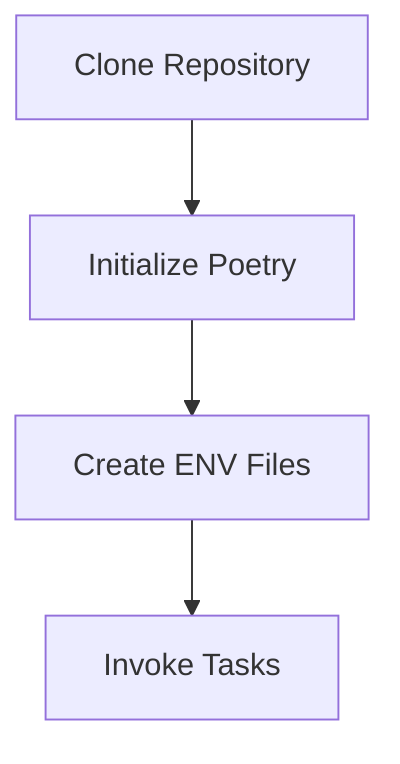

# Getting Started

This guide provides detailed steps to set up and start the project using the provided `tasks.py` file and Poetry for dependency management. Follow these instructions to get up and running quickly.

---

## Prerequisites

Ensure you have the following installed on your system:

### Installing Prerequisites
- **Python 3.10 or later**: [Download and install Python](https://www.python.org/downloads/)
- **Docker and Docker Compose**: [Install Docker](https://docs.docker.com/get-docker/)
- **Poetry**: [Install Poetry](https://python-poetry.org/docs/#installation)
- **MkDocs**: Included in Poetry dependencies; no separate installation required.

---

## Setting Up the Environment



---

### High-Level Folder Structure
```plaintext
infrastructure/
├── load_balancer/
│   ├── Dockerfile.dev
│   ├── haproxy.cfg
├── web_server/
│   ├── Dockerfile.dev
│   ├── app.py
├── nagios/
│   ├── etc/
│   ├── libexec/
mkdocs/
├── docs/
├── mkdocs.yml
docker-compose*.yml
pyproject.yml
poetry.lock
tasks.py
```

## Steps to Start Docker Containers

### 1. Clone the Repository
```bash
git clone https://github.com/kvncampos/infrastructureSetup
```

### 2. Poetry Init
```bash
poetry shell
poetry install
```
### 3. Create ENV Files
At the root level:
```plaintext
touch .env

PROJECT_NAME=<projectName>
ENV=development
```
At infrastructure/nagios/:
```
touch .env

NAGIOSADMIN_USER=nagiosadmin
NAGIOSADMIN_PASSWORD=<Passoword>
NAGIOS_TIMEZONE=UTC
```

### 4. Invoke Tasks
```bash
invoke up
```

??? info "Quick Access to Containers"
    - [MKDocs](http://localhost:8000)
    - [Web Server A](http://localhost:5001)
    - [Web Server B](http://localhost:5002)
    - [HAProxy LB](http://localhost:6000)
    - [Nagios](http://localhost:8080)

## Troubleshooting

### Docker Compose Fails to Start
- **Issue**: Error: `Cannot connect to the Docker daemon`.
- **Solution**: Ensure Docker is running: `sudo systemctl start docker`.

### Poetry Command Not Found
- **Issue**: Poetry commands are not recognized.
- **Solution**: Add Poetry to your PATH: `export PATH="$HOME/.poetry/bin:$PATH"`.