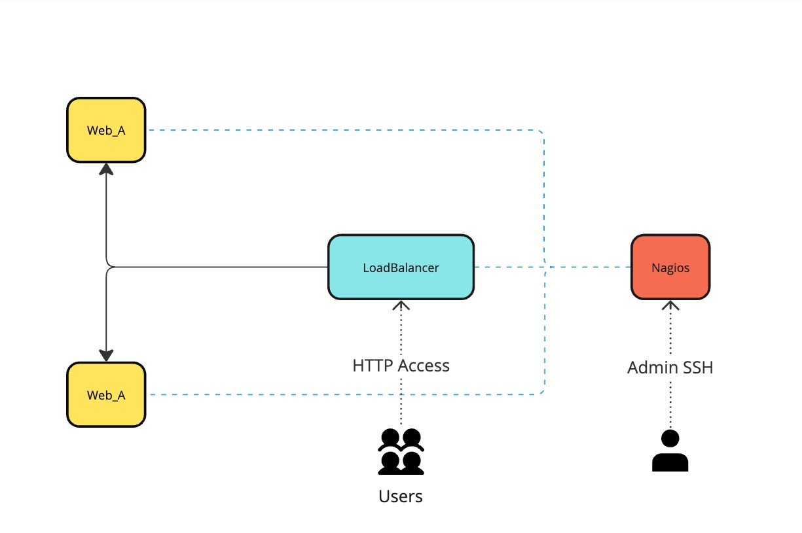

# Welcome to Infrastructure Documentation

This documentation provides an in-depth look at our project's infrastructure design and implementation. It details my thought process, design decisions, and problem-solving approaches. Whether you're a developer, network architect, or end-user, you'll gain insights into how this system evolved, including:

- sources used
- challenges overcome
- lessons learned along the way

## High-Level Design

Here's an overview of the infrastructure:

{ loading=lazy }
/// caption
Infrastructure Design
///

## Technology Used

- :fontawesome-brands-python: [**Flask/Python**](webserver.md)
  - Flask, a lightweight Python web framework, enables rapid development of scalable web applications.

- :fontawesome-brands-docker: [**Docker**](docker.md)
  - Docker simplifies containerization, ensuring consistent environments across development and production.

- :fontawesome-solid-network-wired: [**HAProxy**](loadbalancer.md)
  - HAProxy, a reliable open-source load balancer, optimizes traffic distribution and enhances scalability.

- :fontawesome-solid-chart-bar: [**Nagios**](nagios.md)
  - Nagios offers powerful monitoring capabilities, ensuring system health and uptime with detailed alerts.

## Documentation Overview

This documentation includes the following sections:

- **Project Overview**: (This page) High-level overview of the system and its architecture.
- **About**: Background and additional details about the project.

## Get Started

To dive deeper, visit the [Infrastructure Design](index.md) section or explore [About](about.md).

Visit the [Github Repo](https://github.com/kvncampos/infrastructureSetup){:target="_blank"}