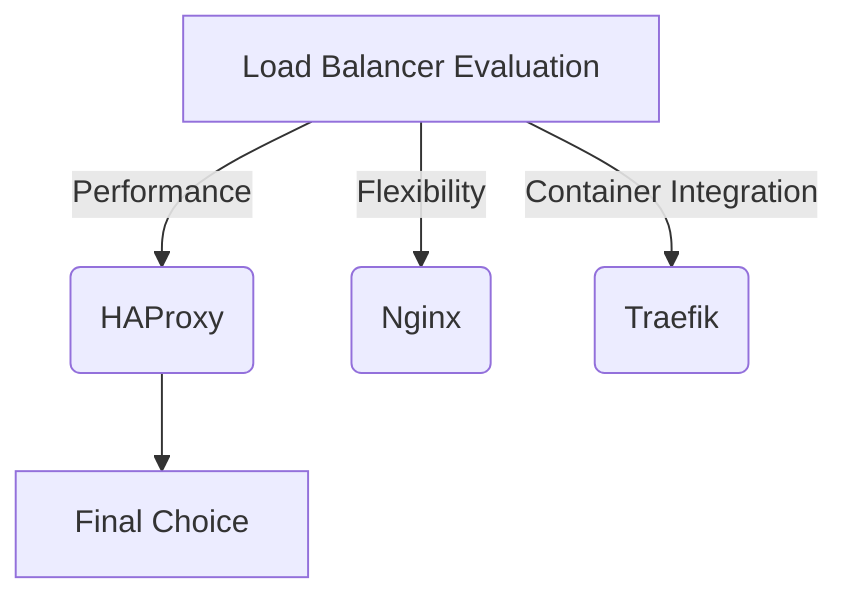

# Load Balancer: HAProxy

This section covers the implementation of HAProxy as the load balancer for this project, including insights into its setup, configuration, challenges faced, and lessons learned. Below, you'll find detailed explanations, relevant configurations, and external resources that guided the implementation.

---

## Overview

??? info "What You'll Learn"
    By the end of this section, you will understand:

    - Why HAProxy was chosen as the load balancer.
    - The process of setting up and configuring HAProxy.
    - Key challenges faced during the implementation.
    - Lessons learned and resources that guided the implementation.

HAProxy plays a critical role in this project by acting as a reverse proxy to distribute incoming traffic efficiently across multiple web servers. This setup enhances scalability and reliability, ensuring optimal performance under varying loads.

---

## Choosing HAProxy

### Why HAProxy?

??? tip "Key Benefits of HAProxy"
    - Performance: Highly efficient and capable of handling high traffic volumes.
    - Flexibility: Supports various load-balancing algorithms and configurations.
    - Stability: Proven reliability in production environments for years.
    - Open Source: Community-driven with strong documentation and support.

While evaluating frameworks, I considered:

- **HAProxy**: Known for performance and configurability in handling web traffic.lity.
- **Nginx**: A versatile choice, but I preferred a dedicated load balancer for this project.
- **Traefik**: Ideal for containerized environments but lacked some features I required.



After comparing these options, HAProxy emerged as the best fit for this project due to its robust features, community support, and long-standing reputation for reliability in production environments.

### Setting Up HAProxy

??? success "Process Summary"
    1. Installing HAProxy via Docker.
    2. Configuring `haproxy.cfg` to define backend servers and load-balancing rules.
    3. Testing the configuration locally and ensuring proper traffic distribution.
    4. Integrating HAProxy with Flask-based web servers.

    ## Getting Started
    For a detailed step-by-step guide, refer to the [Getting Started](getting_started.md) page.


## HAProxy Configuration

Below is a detailed explanation of the `haproxy.cfg` file used in this project. Each section is broken down with a comparison between the current setup and considerations for a production environment.

---

=== "HAProxy Configuration (`haproxy.cfg`)"
    ```plaintext title="haproxy.cfg"
    global
        log stdout format raw local0
        maxconn 4096

    defaults
        mode http
        log     global
        option  httplog
        option  dontlognull
        timeout connect 5s
        timeout client  10s
        timeout server  10s

    frontend http_front
        bind *:60000-60001
        default_backend backend_servers
        option forwardfor


    backend flask_servers
        balance roundrobin
        option httpchk GET /status
        cookie SERVER insert indirect nocache
        server web-a web-a:5001 check cookie web-a fall 1 rise 5
        server web-b web-b:5002 check cookie web-b fall 1 rise 5
    ```

=== "global"
    ```
    global
        log stdout format raw local0
        maxconn 4096
    ```
    `log stdout format raw`

    - **What it does**:
        - Logs activity to `stdout` in raw format, useful for debugging in development.
    - **Production Improvement**: Redirect logs to a centralized logging solution (e.g., ELK Stack, Splunk) for improved observability and long-term storage.

    `maxconn 4096`

    - **What it does**:
        - Limits the number of simultaneous connections to 4096.
    - **Production Improvement**: Tune this value based on your hardware capabilities and expected traffic; perform benchmarking to find the optimal limit.

=== "defaults"
    ```
    defaults
        mode http
        log     global
        option  httplog
        option  dontlognull
        timeout connect 5s
        timeout client  10s
        timeout server  10s
    ```
    `mode http`

    - **What it does**:
        - Configures HAProxy to operate in HTTP mode, enabling HTTP-specific functionality.
    - **Production Improvement**: Ensure this mode is explicitly set for both frontend and backend sections to avoid ambiguities.

    `log global`

    - **What it does**:
        - Uses the logging settings defined in the `global` section.
    - **Production Improvement**: Apply log levels (`info`, `warning`, etc.) to reduce noise in log output and prioritize critical information.

    `option httplog`

    - **What it does**:
        - Enables detailed logging of HTTP requests.
    - **Production Improvement**: Retain this option and consider adding access log analysis tools for deeper insights into traffic patterns.

    `option dontlognull`

    - **What it does**:
        - Prevents logging of connections with no data transfer, reducing log noise.
    - **Production Improvement**: Keep this option enabled to avoid cluttering logs with irrelevant entries.

    `timeout connect 5s`

    - **What it does**:
        - Sets a 5-second timeout for establishing connections to backend servers.
    - **Production Improvement**: Adjust based on the expected latency and server performance in your environment.

    `timeout client 10s`

    - **What it does**:
        - Sets a 10-second timeout for receiving data from clients.
    - **Production Improvement**: Fine-tune this value to match the behavior of your client applications.

    `timeout server 10s`

    - **What it does**:
        - Sets a 10-second timeout for responses from backend servers.
    - **Production Improvement**: Increase this for resource-intensive operations or slow backend servers.

=== "frontend"
    ```
    frontend http_front
        bind *:60000-60001
        default_backend backend_servers
        option forwardfor
    ```
    `bind *:60000-60001`

    - **What it does**:
        - Listens on ports 60000-60001 for incoming HTTP traffic.
    - **Production Improvement**: Use port 443 and SSL certificates for secure HTTPS communication (e.g., `bind *:443 ssl crt /path/to/cert.pem`).

    `default_backend backend_servers`

    - **What it does**:
        - Routes all incoming traffic to the `backend_servers` section.
    - **Production Improvement**: Configure separate frontends and backends for different types of traffic, such as APIs or admin interfaces.

    `option forwardfor`

    - **What it does**:
        - Adds the `X-Forwarded-For` header to requests, preserving the client IP address.
    - **Production Improvement**: Retain this option for proper logging and troubleshooting, especially when using HAProxy as a reverse proxy.

=== "backend"
    ```
    backend flask_servers
        balance roundrobin
        option httpchk GET /status
        cookie SERVER insert indirect nocache
        server web-a web-a:5001 check cookie web-a fall 1 rise 5
        server web-b web-b:5002 check cookie web-b fall 1 rise 5
    ```
    `balance roundrobin`

    - **What it does**:
        - Distributes traffic evenly across backend servers in a round-robin fashion.
    - **Production Improvement**: Use algorithms like `leastconn` (for uneven workloads) or `source` (to maintain session persistence).

    `option httpchk GET /status`

    - **What it does**:
        - Sends HTTP GET requests to `/status` to check the health of backend servers.
    - **Production Improvement**: Customize the health check endpoint to include application-level checks (e.g., database connectivity).

    `cookie SERVER insert indirect nocache`

    - **What it does**:
        - Inserts a session cookie to maintain persistence across requests.
    - **Production Improvement**: Ensure secure cookie attributes (`Secure`, `HttpOnly`) are set when using HTTPS.

    `server web-a web-a:5001 check cookie web-a fall 1 rise 5`

    - **What it does**:
        - Defines a backend server (`web-a`) at `web-a:5001` with health checks. The server is marked down after 1 failed check (`fall`) and marked up after 5 successful checks (`rise`).
    - **Production Improvement**: Use FQDNs for server names and tune `fall` and `rise` values to reflect real-world conditions and minimize downtime.

    `server web-b web-b:5002 check cookie web-b fall 1 rise 5`

    - **What it does**:
        - Similar to `web-a`, defines another backend server (`web-b`) at `web-b:5002` with identical settings.
    - **Production Improvement**: Add more backend servers or dynamically scale using a service discovery mechanism like Consul or Kubernetes.

---

### Recommendations for Production

??? tip "Key Improvements for Production"
    - **Centralized Logging**: Send logs to external monitoring tools like ELK Stack or Splunk for detailed analysis.
    - **SSL Termination**: Configure SSL certificates to enable secure HTTPS communication.
    - **Dynamic Scaling**: Integrate with service discovery tools to dynamically update backend servers.
    - **Rate Limiting**: Add protection against abuse by limiting the number of requests per IP address.
    - **Error Handling**: Use `errorfile` directives to customize error responses.

---


## Challenges Faced

??? danger "Challenges Encountered"
    - Configuration Complexity: Understanding the nuances of haproxy.cfg and adapting it for the project’s needs.
    - Logging and Monitoring: Ensuring adequate visibility into traffic distribution and server health.
    - Performance Tuning: Optimizing HAProxy settings to handle potential traffic spikes.

### How I Solved Them

- Configuration Complexity:
    - Consulted official HAProxy documentation and online resources.
    - Experimented with different configurations to find the most suitable setup.
- Logging and Monitoring:
    - Integrated logging using the log directive in haproxy.cfg.
    - Enabled health checks for backend servers.
- Performance Tuning:
    - Adjusted maxconn and timeout settings to accommodate varying traffic loads.

## Lessons Learned

??? quote "Key Takeaways"
    - HAProxy’s flexibility allows fine-grained control over traffic distribution and server health monitoring.
    - Proper logging and monitoring are essential for diagnosing issues and ensuring high availability.
    - Iterative testing and tuning are critical for achieving optimal performance in production.

## Articles and Resources
Here are some resources I used to understand and configure HAProxy:

- [Official HAProxy Documentation](https://www.haproxy.com/documentation/){:target="_blank"}
- [Four Essential HAProxy Configurations](https://www.haproxy.com/blog/the-four-essential-sections-of-an-haproxy-configuration){:target="_blank"}
    - Going over: global, defaults, frontend, backend.
- [Optimizing HAProxy Configuration](https://loadforge.com/guides/optimizing-haproxy-configuration-for-high-performance){:target="_blank"}
    - Goes over more configuration settings targetted towards High Traffic.
- [HAProxy Health Checks](https://www.haproxy.com/documentation/haproxy-configuration-tutorials/service-reliability/health-checks/){:target="_blank"}
- [Community Forum Discussion](https://stackoverflow.com/questions/23512029/haproxy-health-check){:target="_blank"}

!!! question "Future Enhancements"
    Framework and Application Changes

    - Explore more advanced load-balancing algorithms in HAProxy.
    - Evaluate the need for SSL termination at the load balancer level.

    Monitoring and Security

    - Enhance monitoring with tools like **Prometheus** and **Grafana** for better traffic insights.
    - Implement additional security measures, such as rate limiting and IP whitelisting.
