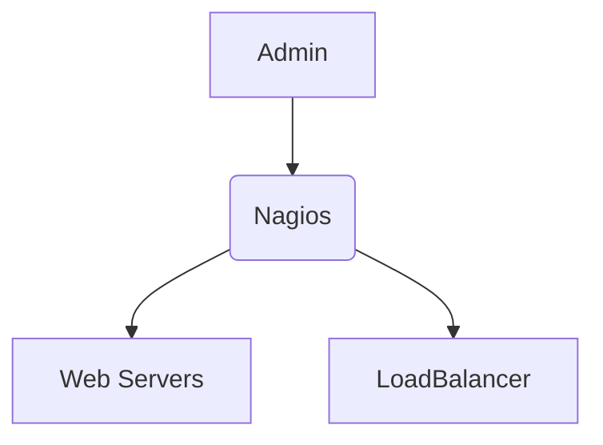

# Nagios: Monitoring and Observability

This section provides a Nagios-centric perspective, covering its setup, configuration, challenges, and lessons learned. It includes detailed explanations, configuration examples, and external resources that guided the implementation.

---

## Overview

??? info "What You'll Learn"
    By the end of this section, you will understand:

    - Why Nagios was chosen for monitoring.
    - The process of setting up and configuring Nagios.
    - Key challenges faced during the implementation.
    - Lessons learned and resources that guided the implementation.

Nagios plays a critical role in this project by providing monitoring and observability, ensuring system health and quick detection of potential issues to maintain uptime and reliability.

---

## Choosing Nagios

### Why Nagios?

??? tip "Key Benefits of Nagios"
    - **Scalability:** Easily integrates with large infrastructures.
    - **Customizability:** Allows tailored checks and plugins.
    - **Reliability:** Proven for monitoring critical systems over time.
    - **Community-Driven:** Strong support and vast resources available.




Due to the purpose of this project and the requirement of using Nagios. This was the only option to choose from. I had heard about Nagios but this was the first time deploying and configuring this monitoring solution.

### Setting Up Nagios

??? success "Process Summary"
    1. Installing Nagios Core on a Linux-based system.
    2. Configuring nagios.cfg to define hosts, services, and alerting rules.
    3. Adding custom plugins for project-specific monitoring needs.
    4. Testing configurations and ensuring proper alerting mechanisms.
        - Due to the nature of the setup we are leveraging Docker Image and Volumes to add custom settings/configurations.

    ## Getting Started
    For a detailed step-by-step guide, refer to the [Getting Started](getting_started.md) page.


Nagios Configuration

This project uses the Nagios Docker image from [Jason Rivers Repository](https://github.com/JasonRivers/Docker-Nagios)

- Volumes are used to add custom configuration files, such as `webservers.cfg` and `haproxy.cfg`,
to the Docker container. This allows for dynamic and flexible updates to the monitoring setup.

=== "Nagios Configuration"
    ```title="nagios.cfg" linenums="1"
    # Things Changed
    cfg_file=/usr/local/nagios/etc/objects/commands.cfg
    cfg_file=/opt/nagios/etc/objects/webservers.cfg
    cfg_file=/opt/nagios/etc/objects/haproxy.cfg
    ```
    `/usr/local/nagios/etc/objects/commands.cfg`

    - **What it does now**: Specifies the location of the commands.cfg file, which contains definitions for custom check commands.
    - **Production Changes**: Ensure this file is regularly reviewed and version-controlled. Consider separating critical commands into distinct directories for modularity.

    `/opt/nagios/etc/objects/webservers.cfg` and `/opt/nagios/etc/objects/haproxy.cfg`


    - **What it does now**:
        - Includes configuration files for web servers and the HAProxy load balancer.
    - **Production Changes**:
        - Use structured directories for organizing files (e.g., objects/web/ or objects/load_balancers/).
        - Enforce naming conventions.

=== "Commands"
    ```title="commands.cfg" linenums="1"
    # 'check_webservers' custom command definition
    define command {
            command_name    check_webservers
            command_line    /opt/nagios/libexec/check_webservers.py
    }
    ```

    - **What it does now**:
        - Defines a custom command check_webservers, which executes the specified Python script `check_webservers.py`.

    - **Production Changes**:
        - Secure the script's execution with permissions and avoid hardcoding sensitive information.
        Use logging in `check_webservers.py` for audit and debugging.
        - Consider migrating commands to a centralized directory under libexec/custom/ for better organization.

=== "HAProxy"
    ```title="haproxy.cfg" linenums="1" hl_lines="1 7 15 24"
    define host {
            use                     linux-server
            host_name               haproxy
            alias                   HAProxy Load Balancer
            address                 haproxy
    }
    define hostgroup {
            hostgroup_name  haproxy-servers      ;
            alias           HAProxy Servers      ;
            members         haproxy      ;
    }
    define service {
            use                             local-service,graphed-service
            host_name                       haproxy
            service_description             PING
            check_command                   check_ping!100.0,20%!500.0,60%
            check_interval                  1    ;
            retry_interval                  0.5  ;
            max_check_attempts              3    ;
    }
    define service {
            use                             local-service,graphed-service
            host_name                       haproxy
            service_description             Current Load
            check_command                   check_local_load!5.0,4.0,3.0!10.0,6.0,4.0
    }
    ```
    `define host`

    - **What it does now**:
        - Defines the HAProxy host with a specific alias and hostname.

    - **Production Changes**:
        - Use a fixed IP address or DNS entry for stability.
        - Include contact groups to define alerting policies.

    `define hostgroup`

    - **What it does now**:
        - Groups all HAProxy servers for unified monitoring.
    - **Production Changes**:
        - Define multiple HAProxy instances if needed for redundancy.
        - Add tagging for roles (e.g., primary, secondary).

    `define service`

    **PING**

    - **What it does now**:
        - Monitors HAProxy availability via ICMP ping.
    - **Production Changes**:
        - Add notification thresholds for escalation (e.g., email after 3 failures).
        - Consider disabling ICMP in high-security environments and replacing with TCP-based checks.

    **Current Load**

    - **What it does now**:
        - Checks HAProxy's CPU load against warning and critical thresholds.
    - **Production Changes**:
        - Adjust thresholds based on server capacity and observed trends.
        - Use dynamic load metrics via plugins.


=== "Web Servers"
    ```title="webservers.cfg" linenums="1" hl_lines="1 7 13 30 37"
    define host {
            use                     linux-server
            host_name               web-a
            alias                   Flask Web Server A
            address                 web-a
    }
    define host {
            use                     linux-server
            host_name               web-b
            alias                   Flask Web Server B
            address                 web-b
    }
    define hostgroup {
            hostgroup_name  web-servers      ;
            alias           Web Servers      ;
            members         web-a,web-b      ;
    }
    define service {
            use                             local-service,graphed-service
            host_name                       web-a,web-b
            service_description             PING
            check_command                   check_ping!100.0,20%!500.0,60%
            check_interval                  1    ;
            retry_interval                  0.5  ;
            max_check_attempts              3    ;
    }
    define service {
            use                             local-service,graphed-service
            host_name                       web-a,web-b
            service_description             HTTP
            check_command                   check_http
    }
    define service {
            use                             generic-service,graphed-service
            host_name                       localhost
            service_description             Web Server Status
            check_command                   check_webservers!5
            check_interval                  1    ;
            retry_interval                  0.5  ;
            max_check_attempts              2    ;
    }
    ```
    `define host`

    - **What it does now**:
        - Defines a host named `web-a` that uses the `linux-server` template.
        - Assigns an alias "Flask Web Server A" for easier identification in logs and reports.
        - Resolves `web-a` as the server address (hostname or IP).
    - **Production Changes**:
        - Ensure `web-a` is a resolvable DNS entry or static IP.
        - Add metadata fields such as `location` or `contact` for operational clarity.
    ??? hint "web-b explanation"
        - Configuration is the same for web-b, the name is all that changes.

    `define hostgroup`

    - **What it does now**:
        - Groups `web-a` and `web-b` under the host group `web-servers`.
        - Simplifies the application of common checks to both servers.
    - **Production Changes**:
        - Add documentation or labels to distinguish production and staging servers.

    `define service`

    **PING**

    - **What it does now**:
        - Monitors the availability of `web-a` and `web-b` using ICMP ping.
    ??? info "PING Deep Dive"
        - Arguments for `check_ping`:
            - `100.0,20%`: Warning thresholds (latency in ms, packet loss percentage).
            - `500.0,60%`: Critical thresholds (latency in ms, packet loss percentage).
        - Intervals:
            - `check_interval`: Runs every 1 minute.
            - `retry_interval`: Retries every 30 seconds on failure.
            - `max_check_attempts`: Alerts after 3 failed attempts.
    - **Production Changes**:
        - Replace ICMP with application-specific health checks for restricted environments.
        - Adjust thresholds based on network performance trends.

    **HTTP**

    - **What it does now**:
        - Checks the availability of HTTP services on `web-a` and `web-b`.
        - `check_http`: Ensures the web server is responding with an expected HTTP status.
    - **Production Changes**:
        - Add arguments to `check_http` for SSL validation or response time thresholds.
        - Monitor additional URLs or endpoints.

    **check_webservers**

    - **What it does now**:
        - Runs the custom `check_webservers` command to monitor web server health.
    ??? info "check_webservers Deep Dive"
        - Argument `!5`: Checks for up to 5 server connections or conditions.
        - Intervals:
            - `check_interval`: Checks every 1 minute.
            - `retry_interval`: Retries every 30 seconds on failure.
            - `max_check_attempts`: Alerts after 2 failed attempts.
    - **Production Changes**:
        - Improve the custom script to include more metrics, such as response time and error rates.
        - Log results for analysis and troubleshooting.


---

### Recommendations for Production

??? tip "Key Improvements for Production"
    - Enable redundant monitoring for high availability.
    - Integrate with modern alerting tools like PagerDuty or Slack.
    - Use encryption for communication between Nagios server and monitored hosts.
---


## Challenges Faced

??? danger "Challenges Encountered"
    - Configuration Complexity: Understanding and adapting nagios.cfg and plugins for project-specific needs.
    - Alert Noise: Fine-tuning thresholds to reduce false positives.
    - Scalability: Adjusting Nagios to efficiently handle growing infrastructure.

### First time using Nagios

This was very confusing at first, especially when just starting out. Thankfully, the documentation is good, and there are plenty of examples to use as a starting point.

I chose the easier route by using a Docker image that includes many boilerplate configurations. While these configurations would need adjustments for production, it works quite well as a starting point.

### How I Solved Them

- Configuration Complexity:
    - Consulted official Nagios documentation and community forums.

## Lessons Learned

??? quote "Key Takeaways"
    - Nagios’ plugin system provides unparalleled flexibility for custom monitoring.
    - Reducing alert noise is essential for effective monitoring.
    - Distributed monitoring is critical for scaling in large environments.

## Articles and Resources
Here are some resources I used to understand and configure HAProxy:

- [Official Nagios Documentation](https://www.nagios.org/documentation/){target="_blank"}
- [Deploy Nagios as Container](https://kifarunix.com/deploy-nagios-as-a-docker-container/){:target="_blank"}
- [Docker-Nagios](https://github.com/JasonRivers/Docker-Nagios)
- [NRPE Configuration Guide](https://assets.nagios.com/downloads/nagioscore/docs/nrpe/NRPE.pdf){:target="_blank"}

!!! question "Future Enhancements"
    **Integration and Automation**

    - Explore integration with Prometheus for metrics collection.
    - Automate plugin deployment using Ansible.

    **Security and Monitoring**

    - Implement SSL/TLS for secure communication.
    - Evaluate advanced visualization tools like Grafana for better insights.