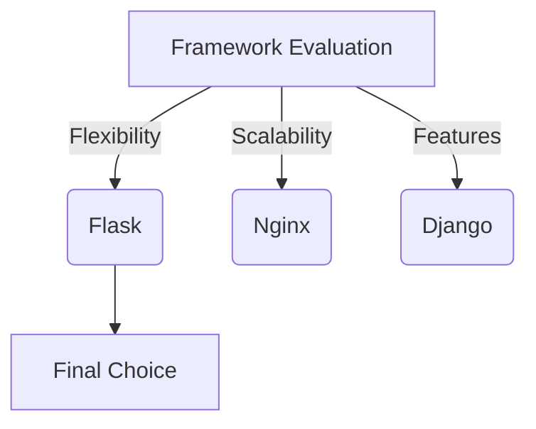
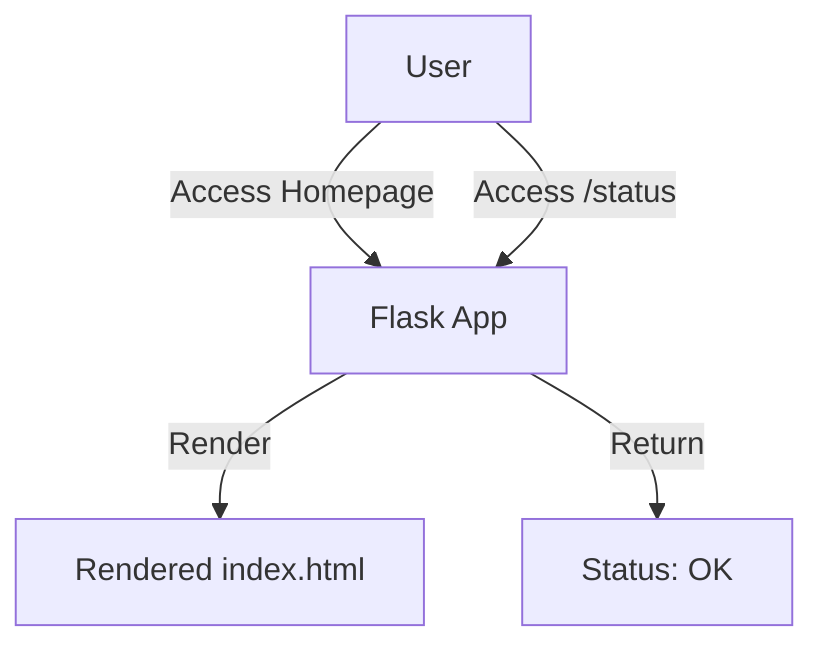

# Web Servers: Flask

This section covers the journey of creating web servers for this project using Flask, exploring the lessons learned, challenges faced, and decisions made along the way. Below, you'll find detailed insights into the thought process, tools, and technologies that contributed to building robust and scalable web servers.

---

## Overview

??? info "What You'll Learn"
    By the end of this section, you will understand:

    - Why Flask was chosen over alternatives like Nginx or other frameworks.
    - The process of setting up the web servers.
    - Key challenges faced and how they were overcome.
    - Lessons learned and resources that guided the implementation.

I have worked with web servers before in personal projects and tutorials, using frameworks like Flask, Node.js, and Django. This familiarity allowed me to quickly build a barebones Flask app, which can be easily modified into a full-fledged web application.

---

## Choosing Flask

### Why Flask?

??? tip "Key Benefits of Flask"
    - Lightweight and minimal.
    - Easy to integrate with Python-based projects.
    - Supports rapid development with an extensive plugin ecosystem.

While evaluating frameworks, I considered:

- **Flask**: A micro-framework offering simplicity and flexibility.
- **Nginx**: Primarily for reverse proxy and load balancing.
- **Django**: A full-stack framework with a heavier footprint.

After comparing these options, Flask emerged as the best fit for this project due to its simplicity and suitability for rapid prototyping.



While Django is familiar and full-featured, it was too heavy for this lightweight project. NGINX offered simplicity but lacked the Python-centric flexibility I preferred. Flask’s minimalism and plugin ecosystem made it the ideal choice for rapid prototyping.


### Setting Up the Web Servers

??? success "Process Summary"
    The web server setup involved:

    1. Installing Flask and configuring the application.
    2. Setting up routes for API endpoints.
    3. Integrating environment variables using `python-dotenv`.
    4. Running the server locally for testing and debugging.

    ## Getting Started
    For detailed, step-by-step instructions on how to set up and run this application, refer to the [Getting Started](getting_started.md) guide.


```py title="app.py" linenums="1" hl_lines="19 25"
import os

from dotenv import load_dotenv
from flask import Flask, jsonify, render_template, request

app = Flask(__name__)

load_dotenv()

web_env = os.getenv("ENV", "development")
message = os.getenv("MESSAGE", "default")

if web_env == "development":
    app.config["DEBUG"] = True
else:
    app.config["DEBUG"] = False


@app.route("/")
def index():
    visitor_ip = request.remote_addr
    return render_template("index.html", message=message, visitor_ip=visitor_ip)


@app.route("/status", methods=["GET"])
def status():
    return jsonify({"status": "ok"}), 200


if __name__ == "__main__":
    is_production = os.getenv("FLASK_ENV") == "production"
    if is_production:
        print("Running in production mode...")
    else:
        print("Running in development mode...")
        app.run(host="0.0.0.0", port=5001, debug=app.config["DEBUG"])
```

## Flask Web App Talk

This Flask application demonstrates environment-based configurations, dynamic routing, and basic API functionality. Below, you'll find detailed explanations for each relevant section of the code.

---

=== "Environment Configuration"
    ```py title="Environment Configuration"
    import os
    from dotenv import load_dotenv

    # Load environment variables from .env
    load_dotenv()

    # Get WEB_ENV from environment
    web_env = os.getenv("ENV", "development")

    # Fetch message from environment variables
    message = os.getenv("MESSAGE", "default")

    # Configure Flask based on the environment
    if web_env == "development":
        app.config["DEBUG"] = True
    else:
        app.config["DEBUG"] = False
    ```
    This section:

    - Loads environment variables using `python-dotenv`.
    - Configures `DEBUG` mode dynamically based on the `ENV` variable.
    - Fetches a custom message (`MESSAGE`) from environment variables.

=== "Routes"
    ```py title="Routes"
    from flask import Flask, jsonify, render_template, request

    app = Flask(__name__)

    @app.route("/")
    def index():
        # Get the visitor's IP address
        visitor_ip = request.remote_addr
        return render_template("index.html", message=message, visitor_ip=visitor_ip)

    @app.route("/status", methods=["GET"])
    def status():
        return jsonify({"status": "ok"}), 200
    ```
    This section defines two routes:

    - **Homepage (`/`)**: Displays an HTML page (`index.html`) with:
        - A message fetched from environment variables.
        - The visitor's IP address.
    - **Health Check (`/status`)**: Returns a JSON response `{"status": "ok"}` with status code `200`.

=== "Running the Application"
    ```py title="Running the Application"
    if __name__ == "__main__":
        # Check the environment to determine the server to use
        is_production = os.getenv("FLASK_ENV") == "production"
        if is_production:
            # Use Gunicorn for production
            print("Running in production mode...")
        else:
            # Use Flask's development server
            print("Running in development mode...")
            app.run(host="0.0.0.0", port=5001, debug=app.config["DEBUG"])
    ```
    This section:

    - Determines if the application is running in production or development mode using the `FLASK_ENV` variable.
    - Prints the mode to the console for debugging purposes.
    - Runs the Flask development server on port `5001` by default.


## Challenges Faced

??? danger "Challenges Encountered"
    - Deployment Issues: Configuring Flask to work efficiently in a production environment.
    - Learning Curve: Adjusting to Flask's minimalistic approach compared to full-stack frameworks.

How I Solved Them

- Deployment: Leveraged Gunicorn for production readiness. (via Docker)
- Scalability: Added Haproxy as a reverse proxy for better load balancing.
- Learning Curve: Explored tutorials, Flask documentation, and online communities
- Flask Documentation: [flask.palletsprojects.com](https://flask.palletsprojects.com)
- Python Dotenv: [dotenv documentation](https://pypi.org/project/python-dotenv/)

## Lessons Learned

??? quote "Key Takeaways"
    - Start small and scale incrementally.
    - Flask is great for rapid prototyping but needs additional tools (e.g., Gunicorn, Nginx) for production.
    - Document every step—debugging becomes easier.

The primary goal of this project was to create a simple yet effective way to launch web servers with load balancing (LB) and monitoring tools. This setup serves as a solid starting point, with independent components that can be expanded or replaced as needed. For instance, Flask operates as a standalone service, making it easy to swap out for frameworks like Django or FastAPI if the project requirements evolve.

This documentation is written not only to share my project but also to offer insights into my approach, acknowledging that there are multiple ways to solve the same problem. My implementation reflects the choices I made based on my understanding and preferences, but it’s not necessarily the "perfect" or "best" way to do it. I encourage readers to adapt, improve, or reimagine these ideas to suit their own needs.

!!! question "What’s Next?"
    Framework and Application Changes

    - Exploring alternatives like **FastAPI** for performance optimization.
    - If the application becomes a bigger project, consider transitioning to **Django**.
    - If the frontend grows, introduce frameworks like **Bootstrap** or other frontend libraries.

    Storage and Scalability

    - No storage currently exists; implement a database or storage solution based on the use case.
    - Scaling the web server architecture to handle high traffic effectively.

    Monitoring and Security

    - Add detailed logging and monitoring tools to track application performance.
    - Introduce security measures, such as HTTPS, input validation, and CSRF protection.

